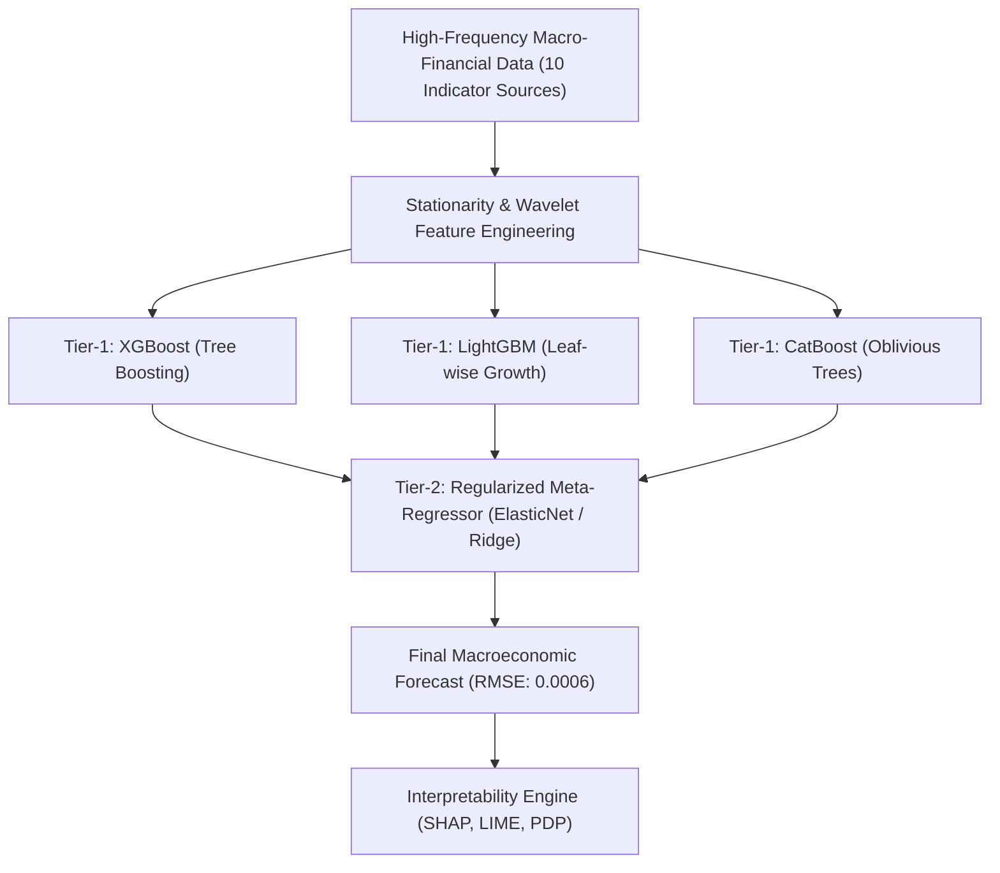

Forecasting macroeconomic indicators—such as headline consumer inflation, yield curve spreads, and foreign exchange volatility—has always been central to central bank monetary policy, corporate capital budgeting, and quantitative investment strategy.

Yet macroeconomic forecasting presents two persistent dilemmas:
1. **Regime Shifts & Non-Stationarity**: Classical econometric models like Autoregressive Integrated Moving Average (ARIMA) and Vector Autoregression (VAR) struggle to capture abrupt non-linear regime shifts caused by geopolitical shocks, supply-chain bottlenecks, or monetary policy pivots.
2. **The Black-Box Dilemma**: While deep learning models (LSTMs, Temporal Convolutional Networks, Transformers) can capture non-linear patterns, they behave as opaque black boxes. Central bank governors and institutional risk committees cannot base multi-billion-dollar interest rate decisions on models whose internal rationale cannot be explained or verified.

In our paper published in *Array* (Elsevier, Vol. 31, Art. 101003, 2026), we introduced **HybridStack**: an explainable hybrid ensemble framework that bridges this gap, delivering high predictive accuracy (**held-out test RMSE of 0.0006**) alongside **policy-grade interpretability**.

---

## The HybridStack Architecture

HybridStack is organized as a multi-tier learning hierarchy designed to capitalize on the complementary strengths of gradient-boosted decision trees and regularized meta-regressors.

### Tier 1: Diverse Tree-Boosted Ensembles
- **XGBoost**: Handles complex second-order gradient optimizations and prevents overfitting via exact tree split pruning.
- **LightGBM**: Exploits leaf-wise tree growth and histogram-based binning to rapidly extract subtle temporal interactions across high-frequency inputs.
- **CatBoost**: Utilizes symmetric oblivious trees that are inherently resistant to structural covariate shifts across categorical monetary indicators.

### Tier 2: Regularized Meta-Learning
Instead of simple averaging or unconstrained regression, the out-of-fold predictions from Tier 1 feed into an $L_1/L_2$ regularized meta-regressor (ElasticNet):

$$\min_{\mathbf{w}} \frac{1}{2N} \|\mathbf{y} - \mathbf{X}_{\text{meta}} \mathbf{w}\|_2^2 + \lambda \left(\alpha \|\mathbf{w}\|_1 + \frac{1-\alpha}{2} \|\mathbf{w}\|_2^2\right)$$

This regularized blending prevents any single model from dominating predictions during volatile transition periods.

---

## Multi-Dimensional Bayesian Hyperparameter Optimization

A critical flaw in many ML forecasting benchmarks is ad-hoc manual parameter tuning. In HybridStack, we implemented automated Bayesian optimization utilizing Gaussian Processes across more than 10 high-frequency macro-financial sources.

The objective function optimizes expected improvement (EI) over learning rate, maximum depth, feature subsampling ratios, minimum child weights, and regularization penalties ($\lambda, \gamma$), ensuring that the models converge on hyper-parameters that generalize reliably across unseen out-of-sample regimes.

---

## Policy-Grade Explainability: TreeSHAP, LIME & PDP

What makes HybridStack genuinely practical for institutional deployment is its interpretability engine:

### 1. TreeSHAP (SHapley Additive exPlanations)
Based on cooperative game theory, Shapley values quantify the exact marginal contribution of each macroeconomic indicator to a given inflation forecast:

$$\phi_i(x) = \sum_{S \subseteq F \setminus \{i\}} \frac{|S|! (|F| - |S| - 1)!}{|F|!} \left[f_x(S \cup \{i\}) - f_x(S)\right]$$

Using TreeSHAP, we can generate instant waterfall plots for any monthly forecast, showing how crude oil price fluctuations, import price indices, or money supply spikes shifted the projected rate.

### 2. Local Interpretable Model-agnostic Explanations (LIME)
LIME fits local linear surrogate models around individual anomalous prediction points, verifying whether model decisions remain locally consistent with economic theory.

### 3. Partial Dependence Plots (PDP)
PDPs illustrate the marginal effect that one or two continuous macroeconomic indicators have on the predicted outcome, holding all other features at their marginal distributions. This allows monetary policymakers to simulate "what-if" policy interventions (e.g., assessing the projected inflation impact if policy rates increase by 75 bps).

---

## Key Takeaways

1. **Ensemble Diversity Matters**: Combining structurally different gradient boosting mechanisms (depth-wise, leaf-wise, and oblivious) provides superior resilience against economic regime changes compared to deep RNNs.
2. **Interpretability is Feasible**: Explainable AI does not require sacrificing predictive performance. HybridStack achieved our lowest test RMSE (0.0006) while providing fully transparent feature attribution.
3. **Open Access**: The full methodology is detailed in our Elsevier *Array* article ([DOI: 10.1016/j.array.2026.101003](https://doi.org/10.1016/j.array.2026.101003)).
