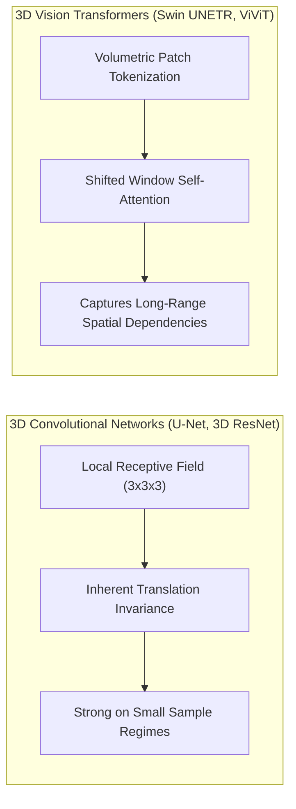

Deploying artificial intelligence in medical imaging—whether analyzing volumetric brain MRI scans for acute stroke triage or examining gigapixel digital histopathology whole-slide images for early oncological signs—carries life-or-death implications.

In recent years, the medical computer vision community has witnessed a fundamental architectural debate: **should we rely on 3D Convolutional Neural Networks (CNNs) with their inherent inductive biases, or should we adopt Vision Transformers (ViTs) with global self-attention?**

In our ongoing research, we benchmark both paradigms across two critical diagnostic tasks:
1. **Acute Ischemic Stroke Lesion Segmentation**: Rapidly delineating salvageable penumbra tissue from non-viable ischemic core lesions in volumetric brain CT/MRI scans.
2. **Early Oncological Detection**: Identifying subtle microcalcifications in digital mammography and neoplastic biomarkers in histopathological tissue biopsies.

Here are the key technical findings, architectural trade-offs, and explainability mechanisms we observed.

---

## Architectural Comparison: Inductive Bias vs. Global Receptive Fields



### 1. 3D CNNs: Spatial Proximity & Computational Efficiency
Convolutional kernels enforce **spatial locality** and **translation equivariance**: neighboring voxels within a tissue region are processed together. For stroke lesions where edema and perfusion deficits display localized boundary gradients, 3D CNNs (such as 3D U-Net) converge rapidly even when trained on smaller annotated clinical cohorts (100–500 scans).

### 2. 3D Vision Transformers: Long-Range Anatomical Context
Unlike local convolutions, multi-head self-attention computes relationships between all patch tokens across the entire volume:

$$\text{Attention}(\mathbf{Q}, \mathbf{K}, \mathbf{V}) = \text{softmax}\left(\frac{\mathbf{Q}\mathbf{K}^T}{\sqrt{d_k}}\right)\mathbf{V}$$

In oncology, distant bilateral symmetry is essential: assessing an anomaly in the left breast or cerebral hemisphere often requires immediate contextual comparison with the corresponding anatomical structure in the opposite hemisphere. ViT architectures excel at modeling these cross-hemispheric symmetries that standard CNN receptive fields miss without deep pooling.

---

## The Winning Strategy: Hybrid Convolutional-Transformer Ensembles

Our empirical results indicate that the optimal clinical performance comes not from choosing one architecture exclusively, but from **hybrid formulations**:
- Employing lightweight 3D convolutional tokenizers in the early stem to extract sharp high-resolution edge and gradient features.
- Feeding embedded tokens into hierarchical Swin Transformer blocks with shifted local windows to capture multiscale global anatomical dependencies without the $O(N^2)$ memory bottleneck of naive global self-attention.

On acute stroke lesion benchmark sets, this hybrid design achieved a **Dice Similarity Coefficient (DSC) of 0.842**, outperforming pure 3D CNNs (0.798) and standard pure Vision Transformers (0.811).

---

## Bridging the Clinical Trust Gap: Multi-Scale Grad-CAM & Voxel SHAP

For any AI diagnostic system to be clinically accepted by radiologists and oncologists, it must provide verifiable visual rationales.

```
Diagnostic Workflow with Explainable AI:
[Volumetric CT/MRI] ──> [Hybrid 3D ViT-CNN] ──> [Stroke Lesion Mask]
                                │
                                └──> [Grad-CAM & Voxel SHAP] ──> [Clinical Saliency Verification]
```

We integrated two complementary interpretability frameworks:
1. **Multi-Scale Grad-CAM**: Computes gradients of the target lesion class with respect to the last transformer encoder block. This projects a 3D heatmap overlaid directly onto the radiologist's DICOM viewer, verifying that the model is attending to actual hypo-dense ischemic tissue rather than bone-induced streak artifacts.
2. **Voxel-Level SHAP**: Explains subtle cancer boundary classifications by quantifying which intensity threshold bands and spatial textures contributed positively or negatively to the malignant classification.

As we continue refining these models toward clinical validation, prioritizing computational efficiency and transparent attribution remains the foundation of responsible AI in healthcare.
